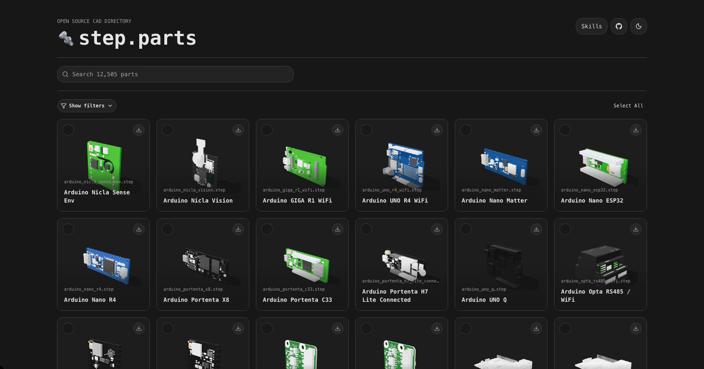

<p align="center">
  
</p>

<h1 align="center">🔩 step.parts 🔩</h1>

<p align="center">
  <a href="https://www.step.parts">Directory</a>
</p>

<p align="center">
  <a href="https://nextjs.org/"></a>
  <a href="https://react.dev/"></a>
  <a href="https://www.typescriptlang.org/"></a>
  <a href="LICENSE"></a>
  <a href="DEVELOPMENT.md#catalog-and-assets"></a>
  <a href="DEVELOPMENT.md#preview-assets"></a>
</p>

<p align="center">12,000+ open source STEP parts for your next CAD project</p>

## 🧱 Parts

step.parts is a searchable directory of open-source STEP models for parts you can drop into CAD assemblies, robot builds, electronics layouts, and mechanical prototypes. Each catalog entry pairs a canonical STEP file with human-authored metadata and generated preview assets.

You can find components such as:

- **🔩 Fasteners and hardware:** screws, nuts, washers, pins, spacers, standoffs, and threaded parts
- **📐 Stock and structural parts:** extrusion profiles, plates, brackets, helper geometry, and enclosure pieces
- **⚙️ Motion and power transmission parts:** bearings, gears, pulleys, shafts, belts, and linear-motion components
- **🔌 Electronics and thermal parts:** development boards, modules, connectors, sensors, heatsinks, and fans
- **🤖 Actuators and robotics parts:** servos, motors, robot actuators, gear reducers, and related mounting hardware

## 🧰 Contributions

Contributions must be made with pull requests. Create a branch, make your catalog changes locally, run the relevant checks, and open a PR for review rather than pushing directly to `main`.

Use the add-part helper to add STEP files to the catalog:

```bash
npm run catalog:add
```

The command prompts for a local STEP file path, part metadata, tags, aliases, optional standard details, and attributes. It generates the part id, copies the STEP file into the catalog, updates the source catalog, refreshes SQLite catalog metadata, exports GLB/PNG previews, and validates everything.

Preview the generated record without writing files:

```bash
npm run catalog:add -- --dry-run --step /path/to/part.step --name "Example part" --category fastener --family socket-head-cap-screw --tag screw --attr thread=M3
```

Before opening the PR, review:

- the new source entry in `catalog/parts.json`
- the canonical STEP file in `catalog/step/`
- regenerated SQLite catalog in `catalog/parts.sqlite`
- generated preview URLs; local `public/glb/` and `public/png/` files should not be committed

Then run the relevant checks:

```bash
npm run catalog:check
npm run lint
npx tsc --noEmit
```

See [`TAGGING.md`](TAGGING.md) for tag conventions and [`DEVELOPMENT.md`](DEVELOPMENT.md) for catalog schema, asset generation, and deployment details.

## 💻 Local Development

Use Node.js 22.5 or newer. The repo includes `.nvmrc`, so `nvm use` will select the same major version used by CI.

```bash
npm install
npm run dev
```

Open [http://localhost:3000](http://localhost:3000).

For catalog generation, preview assets, validation, and deployment notes, see [`DEVELOPMENT.md`](DEVELOPMENT.md).

## 🧪 API

The public API lives under `https://api.step.parts/v1`. The app also uses the same `/v1` routes locally for server-side search, filtering, counted downloads, and pagination.

Common lookups:

- `https://api.step.parts/v1/parts?pageSize=100`
- `https://api.step.parts/v1/parts?q=M3&tag=screw&page=2`
- `https://api.step.parts/v1/parts?category=fastener&family=socket-head-cap-screw&standard=ISO%204762`
- `https://api.step.parts/v1/parts?q=lengthMm%2012`

Machine-readable docs are available at `https://api.step.parts/v1/openapi.json`, `https://api.step.parts/v1/catalog/schema`, and `https://api.step.parts/v1/catalog/parts.index.json`.

## 🌐 License

This repository is MIT-licensed for original project material.

Some STEP/model files are copied from, modified from, adapted from, or generated using clearly licensed third-party model sources. The MIT License does not relicense third-party-derived STEP/model files. See [`THIRD_PARTY_NOTICES.md`](./THIRD_PARTY_NOTICES.md) for source, attribution, modification, and license details.
